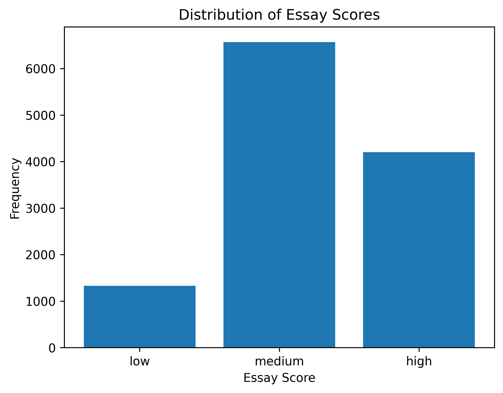
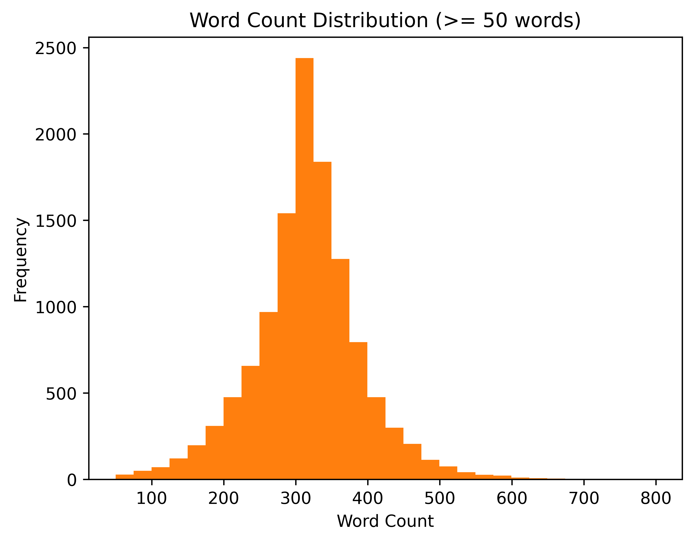
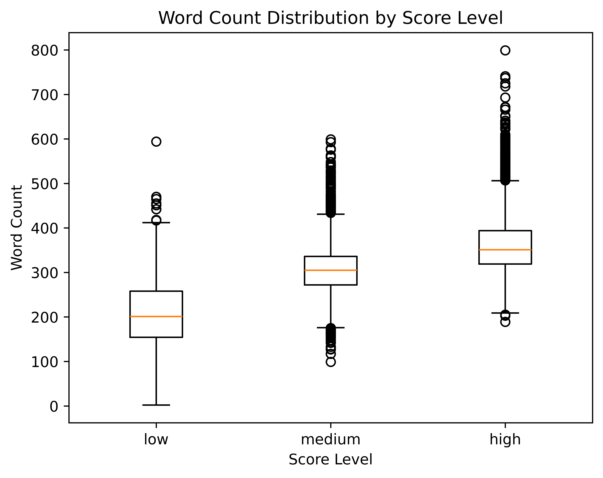

# TOEFL11 BERT

## 1. Project Overview
This project aims to build an Automated Essay Scoring (AES) system for TOEFL-style essays using a BERT-based model. 

## 2. Motivation
- Traditional AES relies on handcrafted linguistic features
- This project explores an end-to-end neural approach using pretrained language models

## 3. Model Architecture

## 4. Dataset
- TOEFL11
- Essays are scored in a continuous scale
- Each essay is annotated with a proficiency level (low, medium, high)

## 5. Training Details
- Loss Function: Mean Squared Error (MSE)
- Optimizer: Adam
- Evaluation Metric: Quadratic Weighted Kappa (QWK)

## 6. Current Progress
- [X] Repository initialized
- [X] Environment setup
- [ ] Data preprocessing
- [ ] BERT baseline implementation
- [X] Dataset analysis and visualization

## 7. Future Work
- Add attention mechanism
- Prompt-wise analysis
- Performance comparison with baseline models

## Input Representation Visualization

We visualize the input representation of essays at different stages.

**Fig.1. Raw essay input example**  

**Fig.2. POS-tag combined input representation**  

**Fig.3. BERT input representation with self-attention (BertViz)**  

## Dataset Analysis

To better understand the characteristics of the TOEFL11 dataset, we analyze
the distribution of essay scores, lengths, and country-level score patterns.

**Fig.4. Distribution of essay score levels (low, medium, high)**  

**Fig.5. Distribution of essay word counts**  
Essays with fewer than 50 words are excluded to reduce noise.  

**Fig.6. Word count comparison across score levels**  

**Fig.7. Distribution of score levels by country**  

